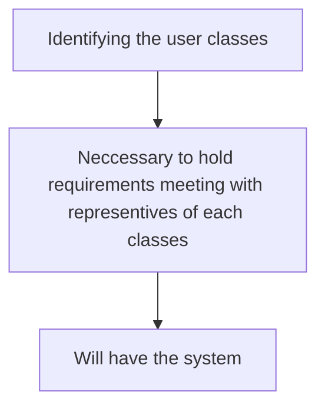

# Why we need?
- To end user, the interface is the system. Most end users do not know nor do they even need to know, about the underlying structure and implementation of the software system. They are concerned only with the interface presented to them and the capabilities provided by that interface.
- The analogy of driving a car: the driver does not need to know anything about how an internal combustion engine works and how it is connected to the transmission to send power to the wheels, nor do they need to know about hydraulics and fluid dynamics of the braking system to actually drive a car. Indeed, mainly the driver  needs to know that "D" means drive, press gas pedal to go, press brake pedal to stop.^[Automatic transmission]
- End users are concerned only with what they can do the system and how they do it, not with how it works "under the hood." Hence it is  vital importance to get the interface design sufficiently correct so that it serves users in an efficient and usable manner.

# What is this?
- Human-computer interaction design must account for the user of the software. 
- While designing the architecture and detailed design of software systems is essential for meeting most quality attributes, design an efficient user interface that is understandable by the end user is paramount to the usability quality of all successful software system. The most elegant, efficient and high-quality architectural and detailed designs can be felled by a poor interface.

>[!note] HCI defined by IEEE
>An interface that enables information to be passed between a human user and hardware or software components of a computer systems.

## Graphical user interface (GUI)
>[!note] Definition by Rosson and Carroll 2002
>Involves selecting appropriate information presentation and interaction techniques for the various end-user classes.

- This entails selecting appropriate information layouts, correct language, appropriate interface controls and trying the detailed design to the various input mechanisms provided in the interface.
- The implication is that there will be multiple interaction of a process that includes the following in 4 HCI design tasks:
	1. Creating a prototype of the system
	2. Having end users use that prototype in realistic ways.
	3. Gathering data from these tests.
	4. Redesigning the interface to address discovered problems.
- All of this work hinges on a through understanding of the users of the system. It is paramount to learn how the users typically perform similar actions and what their expectations of the new system may be.
# Why study?
- Visual designs have a major role in the success or failure of software systems. Systems that meet functional requirements but are not usable cannot succeed. Providing an interface that allow users to accomplish their goals with the software, without unnecessary effort, is the ultimate goal of the user interface designer.
- The major concern of the HCI designs may include the evaluation and use of modes, navigation, visual designs, response time and feedback and design modalities such as forms and menu-driven.
- Many design principles and evaluation techniques exist to successfully design user interfaces. Therefore, understanding the techniques and tools for designers to become proficient in creating efficient interfaces.

## Example
![[Pasted image 20250822155615.png]]
- The user interface could ask the user to type in the date in a text box. Without any extra information a user could type any of the following:
	1. Jan 1, 2011
	2. 1 / 1 / 11
	3. 1 - 1 - 11
	4.  1 January 2011
- The most flexible option involves allowing all of these and others as valid input to find the appropriate fields for month, day and year from that input string. This is a nontrivial solution and does not help the user form a basis or understanding of the desired input.
- A simpler solution involves adding involves a adding a label to the input box specifying the appropriate format (MM/DD/YYYY) . The option works fine and helps the user understand the expected formats for date objects, knowledge that can be leveraged in other software systems with similar requirements. Finally, to address input errors, error indicators in the interface are introduced to help guide the user the correct input format.

>[!note]
>Many options for date input could be used instead, including drop-down lists, graphical mini-calendars for selecting the data and spinners. Each of these options has been used with varying levels of success in various applications. Learning which method works for a specific software system requires end-user testing.
>
>Create prototype systems or mock-ups with each design choice, have users complete realistic tasks using these systems, record information about the users' performance and empirically determine the best design. The effort is significant and requires time and resources to accomplish correctly.

![[Pasted image 20250822163705.png]]

## How do we go about involving the user in the process?

### 1. Identifying the user classes
- A user class is a set of users who share common tasks with the software. Consider a student information system that may be used by a university^[Student and Faculty]. Other classes might not be immediately obvious could include department chairs, registrar, advisors, enrolment management staff and financial aid staff.

>[!example] A single person could take on the characteristics of multiple classes.
>A faculty member could also be an advisor and a department chair. Each of the user classes to which a user belongs contributes to the type of work that user should be to perform with the software.

### 2. Necessary to hold requirements meeting with representatives of each classes
- Meeting should elicit the tasks that the target user class should be able to do with software as well as tasks that would be "nice" to have.
- Similar to software architects, it is  common for user interface designers to go back and forth  between requirement and design, until the interface is sufficiently appropriate to accommodate the needs of users of each class.

### 3. Will have the system
- Challenging thing for software engineers: to disconnect from the system they are designing and try to see the world through the eyes of the end user.
- It is tempting to simply design and interface that meets the needs of the engineer or developer^[Testing and verigication] instead of designing an interface that meets the needs of the end user.
- Software developers to maintain a clear focus on the end user while developing the user interface for a system.